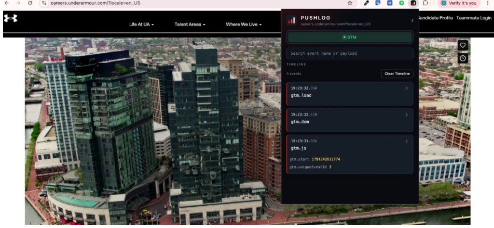

  

  
  &nbsp;&nbsp;
  
  &nbsp;&nbsp;
  
  &nbsp;&nbsp;
  

<h2 align="center">About</h2>

<table>
  <tr>
    <td valign="top" width="62%">
      I'm a Software Engineer at CarMax specializing in analytics engineering, tag management, and digital measurement solutions.
        
      Outside of engineering, I help grow Baltimore's technology ecosystem through events, workshops, mentorship, and community-building initiatives.
    </td>
    <td valign="top" width="38%">
      <strong>Focus</strong>
      <ul>
        <li>Adobe Analytics</li>
        <li>Adobe Experience Platform</li>
        <li>Adobe Launch</li>
        <li>Google Tag Manager</li>
        <li>React</li>
        <li>TypeScript</li>
      </ul>
    </td>
  </tr>
</table>

<h2 align="center">GitHub Stats</h2>

<table>
  <tr>
    <td align="center" width="58%">
      
    </td>
    <td align="center" width="42%">
      
    </td>
  </tr>
</table>

<h2 align="center">Currently building: PushLog</h2>

  

  A Chrome extension I'm building to inspect analytics events in real time without opening browser DevTools.

<table align="center">
  <tr>
    <td valign="top" width="50%">
      <ul>
        <li>Captures events as they happen</li>
        <li>Separates Adobe Client Data Layer activity</li>
        <li>Tracks AEP Web SDK events</li>
      </ul>
    </td>
    <td valign="top" width="50%">
      <ul>
        <li>Monitors Google Tag Manager activity</li>
        <li>Provides searchable payload inspection</li>
        <li>Simplifies analytics validation workflows</li>
      </ul>
    </td>
  </tr>
</table>

<h2 align="center">Community</h2>

<table align="center">
  <tr>
    <td align="center" valign="top" width="50%">
      <a href="https://bmoretechnights.com"><strong>Bmore Tech Nights</strong></a>
       
      A monthly Baltimore tech meetup.
    </td>
    <td align="center" valign="top" width="50%">
      <a href="https://bmoretechweek.com"><strong>Baltimore Tech Week</strong></a>
       
      A citywide week for builders and partners.
    </td>
  </tr>
</table>

<h2 align="center">Speaking</h2>

<table align="center">
  <tr>
    <td valign="top" width="320">
      <strong>I've spoken at</strong>  
      Per Scholas Baltimore 
      Morgan State University 
      American University 
      StarTUp at the Armory (UpSurge Baltimore) 
      Tech Woke Podcast 
      Baltimore Creators Podcast
    </td>
    <td valign="top" width="280">
      <strong>Topics</strong>  
      Practical AI 
      Analytics Engineering 
      Software Development 
      Career Growth 
      Community Building 
      Emerging Technology
    </td>
  </tr>
</table>
