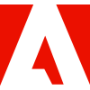
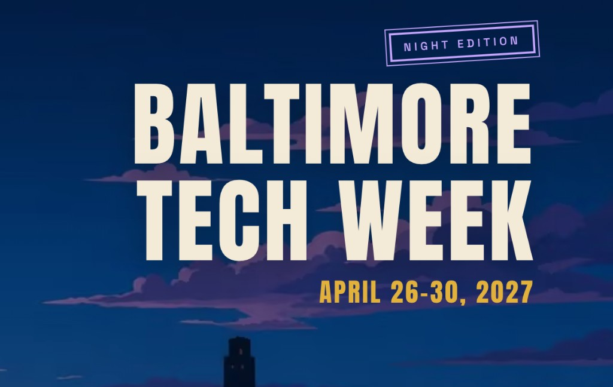

  

<h1 align="center">Khalif Cooper</h1>

  <strong>Software Engineer • Analytics Engineer • Community Builder</strong>

  Building analytics tools, teaching practical AI, and growing Baltimore's technology ecosystem.

  
  &nbsp;&nbsp;
  
  &nbsp;&nbsp;
  
  &nbsp;&nbsp;
  

  

---

<h2 align="center">About Me</h2>

<table>
  <tr>
    <td valign="top" width="62%">
      I'm a Software Engineer at CarMax specializing in analytics engineering, tag management, and digital measurement solutions.
        
      Outside of engineering, I help grow Baltimore's technology ecosystem through events, workshops, mentorship, and community-building initiatives.
    </td>
    <td valign="top" align="center" width="38%">
      <strong>Focus</strong>  
      Adobe Analytics 
      Adobe Experience Platform 
      Adobe Launch 
      Google Tag Manager 
      React 
      TypeScript
    </td>
  </tr>
</table>

---

<h2 align="center">Mission</h2>

  <em>I help people turn technology and AI into practical skills, products, and meaningful connections by building apps, teaching hands-on workshops, and bringing Baltimore's tech community together.</em>

---

<h2 align="center">GitHub Stats</h2>

<table>
  <tr>
    <td align="center" width="58%">
      
    </td>
    <td align="center" width="42%">
      
    </td>
  </tr>
</table>

  

---

<h2 align="center">Tech Stack</h2>

<h3 align="center">Development</h3>

<table align="center">
  <tr>
    <td align="center" width="96"> JavaScript</td>
    <td align="center" width="96"> TypeScript</td>
    <td align="center" width="96"> React</td>
    <td align="center" width="96"> HTML</td>
    <td align="center" width="96"> CSS</td>
    <td align="center" width="96"> Git</td>
    <td align="center" width="96"> GitHub</td>
    <td align="center" width="96"> VS Code</td>
  </tr>
</table>

<h3 align="center">Analytics & MarTech</h3>

<table align="center">
  <tr>
    <td align="center" width="140"> Adobe Analytics</td>
    <td align="center" width="140"> AEP</td>
    <td align="center" width="140"> Adobe Launch</td>
    <td align="center" width="160"> Google Tag Manager</td>
  </tr>
</table>

---

<h2 align="center">Featured Project</h2>

<h3 align="center">Pushlog</h3>

  

  Pushlog is a Chrome extension that helps developers, analysts, and marketers inspect analytics events in real time without opening browser DevTools.

<table>
  <tr>
    <td valign="top" width="50%">
      <strong>What it does</strong>  
      Captures events as they happen 
      Separates Adobe Client Data Layer activity 
      Tracks AEP Web SDK events
    </td>
    <td valign="top" width="50%">
        
      Monitors Google Tag Manager activity 
      Provides searchable payload inspection 
      Simplifies analytics validation workflows
    </td>
  </tr>
</table>

---

<h2 align="center">Community Impact</h2>

<table>
  <tr>
    <td align="center" valign="top" width="42%">
      
        
      <strong>Bmore Tech Nights</strong>
        
      A monthly gathering for Baltimore's technology community to meet, share ideas, learn, and build relationships.
    </td>
    <td align="center" valign="top" width="58%">
      
        
      <strong>Baltimore Tech Week</strong>
        
      A citywide week I help organize for technologists, founders, companies, and community partners.
    </td>
  </tr>
</table>

---

<h2 align="center">Speaking & Workshops</h2>

<table align="center">
  <tr>
    <td align="center" valign="top" width="320">
      <strong>I've spoken at</strong>  
      Per Scholas Baltimore 
      Morgan State University 
      American University 
      StarTUp at the Armory (UpSurge Baltimore) 
      Tech Woke Podcast 
      Baltimore Creators Podcast
    </td>
    <td align="center" valign="top" width="280">
      <strong>Topics</strong>  
      Practical AI 
      Analytics Engineering 
      Software Development 
      Career Growth 
      Community Building 
      Emerging Technology
    </td>
  </tr>
</table>

---

<h2 align="center">Open To</h2>

  <strong>Speaking</strong> · Workshops · Conferences · Partnerships · Panels · Collaborations

---

<h2 align="center">Connect</h2>

  <a href="https://www.khalifcooper.dev">Website</a> •
  <a href="https://www.linkedin.com/in/kcooperdev/">LinkedIn</a> •
  <a href="https://x.com/kcooperdev">X</a> •
  <a href="https://bsky.app/profile/techwithkhalif.bsky.social">Bluesky</a>

---

  <em>Building Analytics Tools • Teaching Practical AI • Growing Baltimore Tech</em>

  
    Social icons by <a href="https://fontawesome.com/">Font Awesome</a>.
    Tech icons by <a href="https://www.tech-stack-icons.com/">Tech Stack Icons</a>.
    Stats by <a href="https://github.com/stats-organization/github-stats-extended">GitHub Stats Extended</a>.
  

